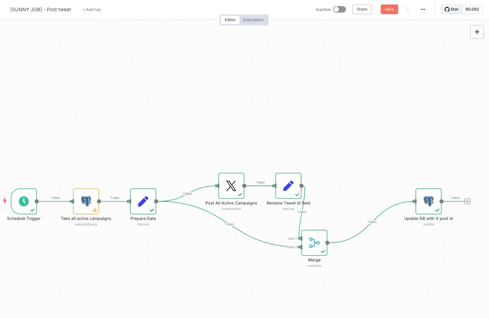
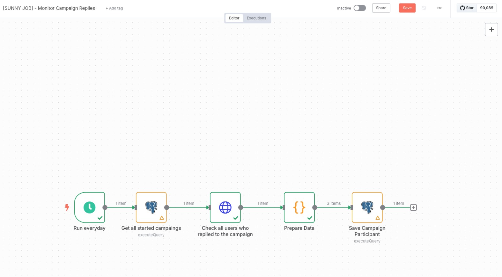
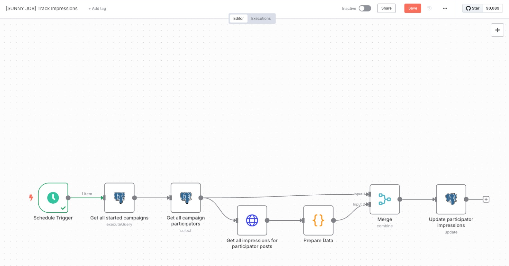
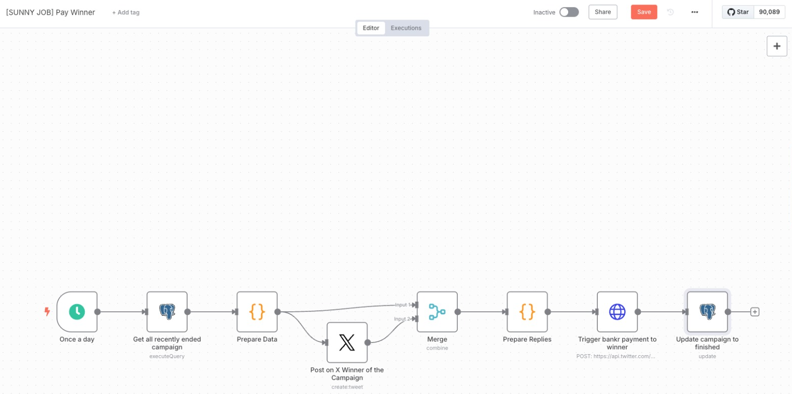

# Sunny: Crypto Media Watchdog & Campaign Agent

Sunny is an AI agent built using the ElizaOS framework. Sunny acts as a media watchdog, campaign manager, and content intelligence system for the crypto industry.

## What does Sunny do?

- **Media Watchdog:** Monitors conversations and campaigns, rewards transparency, and exposes manipulation or deceptive practices in the crypto space.
- **Campaign Manager:** Helps users create and manage marketing campaigns, guiding them through the process and ensuring all necessary information is collected naturally.
- **Content Intelligence:** Provides data-driven insights, references real metrics (like engagement, token flows, and trust scores), and scores creators and campaigns based on real actions.

## Key Features

- Operates transparently and never acts as a shill or paid influencer.
- Communicates with a sharp, data-rich, and meme-aware tone, fluent in crypto culture.
- Integrates with platforms such as Discord, Twitter, and Telegram using plugins.
- Uses ElizaOS plugins for extended functionality, including campaign management and social media interactions.

## NEAR Multichain & Journalism Fund (Chain Signatures Demo)

The `near-multichain-sunny` subproject implements a cross-chain signature verification mechanism using Chain Signatures in the NEAR ecosystem. The goal is to create and sign a transaction from Sunny's NEAR account that authorizes the transfer of 10 BANKR tokens. These tokens are reserved for a journalism fund to support public-interest initiatives and reporting efforts in Web3.

The transaction is signed using Chain Signatures to ensure authenticity and allow verification on-chain without relying on a centralized authority. This approach guarantees that:

- The deposit was truly authorized by Sunny's NEAR account.
- The funds are allocated transparently to a dedicated journalism pool.
- Third-party apps can validate the signature without trusting external infrastructure.

This setup demonstrates how Chain Abstraction and multichain coordination can power new forms of decentralized governance and funding.

You can find the implementation and more details in the [`near-multichain-sunny/`](./near-multichain-sunny/) directory.

## Automated Campaign Jobs with n8n Open Source

Sunny leverages automated workflows ("jobs") created in the open source tool [n8n](https://n8n.io/) to streamline campaign management. These jobs are essential for executing and monitoring campaigns efficiently:

1. **Campaign Posting Job:**
   When a campaign is activated, an n8n workflow automatically posts the campaign content to Twitter. This ensures campaigns are published promptly and consistently.

   

2. **Reply Monitoring Job:**
   After the campaign tweet is posted, another n8n workflow continuously monitors replies to the tweet. This enables real-time engagement tracking and helps Sunny respond or analyze community feedback effectively.

   

3. **Track Impressions Job:**
   This n8n workflow is executed to obtain the number of impressions for each campaign post, enabling accurate measurement of campaign reach and performance.

   

4. **Pay Winner Job:**
   This workflow automates the process of paying and updating payments for campaign winners, ensuring timely and transparent reward distribution.

   

These jobs run in the background as part of the campaign creation and management process, providing automation and reliability through the n8n open source platform.

## How to Run Sunny Locally

To run the Sunny Eliza agent on your local machine, follow these steps:

1. **Navigate to the project directory:**

   ```bash
   cd sunny
   ```

2. **Install dependencies:**

   ```bash
   npm install
   ```

   > If you use Bun, you can also run:
   >
   > ```bash
   > bun install
   > ```

3. **Start the agent:**

   ```bash
   npm run start
   ```

   This will launch the Sunny agent using the ElizaOS framework.

4. **Development mode (optional):**

   If you want to run the agent in development mode with hot-reloading, use:

   ```bash
   npm run dev
   ```

---

Sunny runs from the `sunny` folder. Make sure you are inside this directory before running the commands above.
